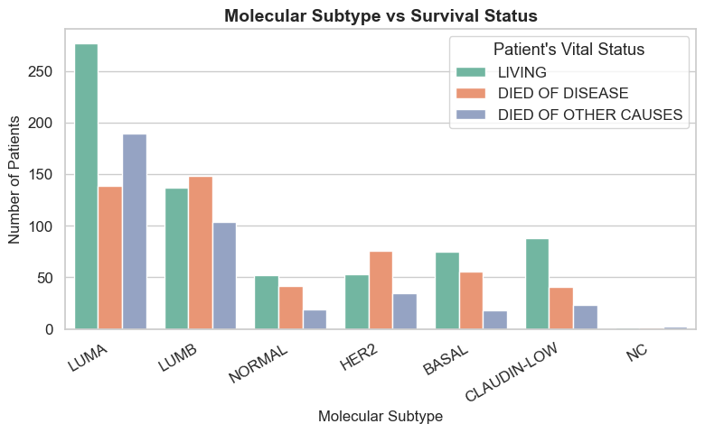
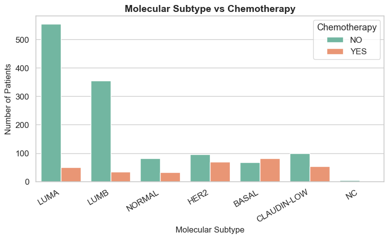
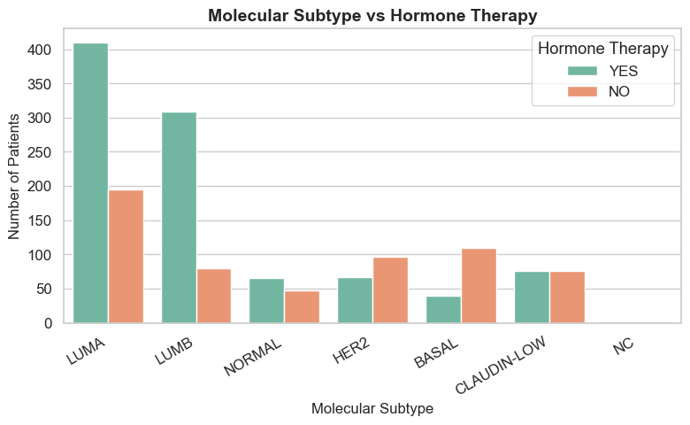
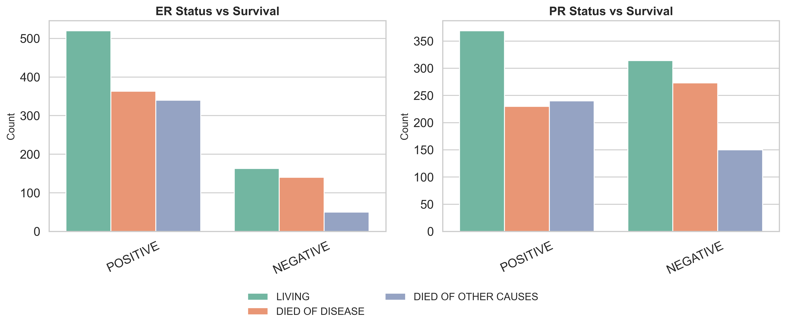
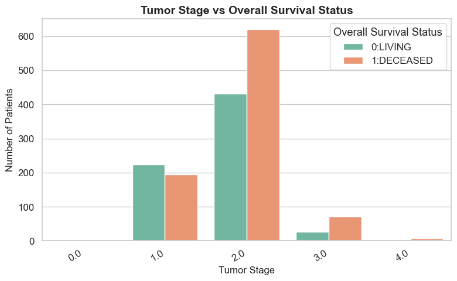
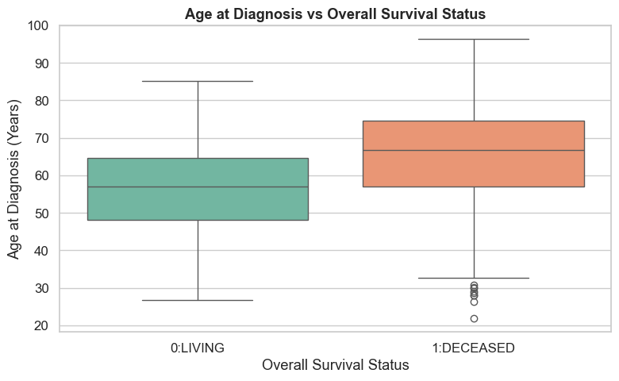

***
## OVERVIEW
This project applies machine learning to predict breast cancer molecular subtypes and patient survival outcomes. It provides a cost-effective, data-driven alternative to molecular test
(PAM50 Assay), helping doctors make informed treatment and prognosis decisions.

## PROBLEM STATEMENT
This project aims to predict breast cancer subtypes and survival outcomes using machine learning, providing an accessible alternative for hospitals without advanced genetic tests like PAM50 to support better treatment decisions.

## Business Objectives
This project aims to create machine learning models that deliver clinical value by:

1. Molecular Subtype Prediction: Developing a model to predict PAM50 + Claudin-low breast cancer subtypes, providing a cost-effective digital alternative to genetic testing for guiding personalized treatment.
2. Binary Survival Prediction: Predicting patient survival status (Living or Deceased) to help identify high-risk patients early for closer monitoring or targeted therapy.
3. Multi-class Vital Status Prediction: Classifying survival outcomes as Died of Disease, Died of Other Causes, or Living to distinguish cancer-related deaths and support deeper clinical insight.
4. Deploy the final models [link](https://breast-cancer-predictor-ziud.onrender.com/) 

## Data Understanding
The dataset comes from the METABRIC (Molecular Taxonomy of Breast Cancer International Consortium) study — a well-known clinical and genomic breast cancer dataset containing information on 2,509 patients. Each record represents a patient, with 39 features (12 numerical and 27 categorical). The data is stored in a TSV (tab-separated values) format.

Key Features:
* Pam50 + Claudin-low subtype: Molecular subtype classification (Luminal A, Luminal B, HER2-enriched, Basal-like, Normal-like).
* Nottingham Prognostic Index (NPI): Combines tumor size, grade, and lymph node status for prognosis prediction.
* Age at Diagnosis, Tumor Size, and Tumor Stage: Describe patient demographics and tumor characteristics.
* ER, PR, HER2 Status: Biomarkers critical for determining subtype and treatment response.
* Therapy Indicators: Whether the patient received chemotherapy, hormone therapy, or radiotherapy.
* Lymph Nodes Examined Positive: Shows whether the cancer has spread to the lymph nodes.
* Neoplasm Histologic Grade & Cellularity: Checks tumor aggressiveness.
* Overall Survival & Relapse-Free Status: Capture survival duration and recurrence of the disease.

Data Quality:
Some columns contain missing values (e.g., Tumor Stage – 721, Type of Surgery – 554, Cellularity – 592).
Missing values in numerical columns are imputed with the median, while categorical columns with missing values are dropped.

Target Variables:
* Pam50 + Claudin-low subtype → Multi-class target for molecular subtype prediction.
* Overall Survival Status → Binary target for survival prediction (Living / Deceased).
* Patient’s Vital Status → Multi-class target for classifying survival outcomes (Living / Died of Disease / Died of Other Causes).


## METHODS
This project uses predictive statistics and descriptive statistics to analyze data, reveal key clinical insights, and build machine learning models that predict breast cancer subtypes and patient survival outcomes.

## EDA
#### Molecular Subtype vs Survival Status



* Comparing survival across molecular subtypes, Luminal A shows the best survival outcomes (highest number of living patients), indicating that this subtype responds well to treatment.

#### Comparing How Different Molecular Subtype Respond to Chemotherapy



* Luminal A show the highest resistance to chemotherapy, suggesting slow response to this type of treatment.
* Basal and HER2 subtypes show good responsiveness to chemotherapy.

#### Comparing How Different Molecular Subtype Respond to Hormone therapy



* Luminal A and Luminal B show the best response to hormone therapy. These Pam50 subtypes usually depend on estrogen or progesterone hormone to grow, and they can often be treated by blocking these hormones

#### ER and PR Status VS Survival rate



* ER+,PR+ have higher survival rates compared to ER-,PR-. ER+ and PR+ have the highest number of living patients and the gap between living patients bar and
lower score for patients who died of disease. ER-,PR- show poor prognosis

#### How Tumor Stage Influnce Survival Status



Lower stages (0 and 1) have better survival rates compared to higher stages(2 and 3)

#### How Age at Diagnosis Influence Survival




Most deceased patients are older. The plot also shows a few outliers within the deceased group, suggesting that while older patients generally have lower survival rates, some younger women also experience poor outcomes(Below 39). Middle-aged women (45–70 years) show the best survival rates overall.

Most Deceased patients are of older age. From the plot there are some outliers for the DECEASED class suggesting that there is lower survival rates for some younger women and older women. Middle-aged women (45-70) show the best survival rates.

## RESULTS
### Molecular subtype prediction
Classify tumors into molecular subtypes using clinical and genetic features 
2 models were build for this task, Random Forest and XGBoost
* Models performance comparisons.
Random Forest acheived an Accuracy of 67% and Macro F1-score of 56%
XGBoost achieved an Accuracy of 67% and Macro F1-score of 54%
Random Forest is the Best performing model because it has highest Macro F1-score. We compare using Macro F1-score because the classes are imbalanced and we desire to treat each class equally

### Survival Status Prediction
Build models that Predict whether a patient is alive or deceased this will allow us to identify high-risk patients who may need closer monitoring.
* Models performance comparisons
The Random Forest model performed best for this prediction compared to Logistic Regression model. It achieved an Accuracy of 73% and 
ROC-AUC of 79% while Logistic Regression model have an Accuracy of 68% and ROC-AUC of 77%, we compare using ROC-AUC because this is a binary classification
Both models are better at predicting deceased patients than living patients, which is clinically important for identifying high-risk individuals.
Random Forest’s higher ROC-AUC shows it can better capture complex interactions between clinical and molecular features.

### Vital Status Prediction
This will help distinguish cancer-related deaths and death from other causes.
It also reveals which clinical or molecular features are most associated with cancer-specific mortality.
It also help us identify high-risk patients and knowing who is at risk of dying from cancer allows closer monitoring and guided treatment approach.
For this part we build a Random Forest, XGBoost and Tuned XGBoost model
* Models performance comparisons
The XGBoost performed better with an Accuracy of 58%, macro F1 score of 0.57 it performed better on the minority “DIED OF OTHER CAUSES” class.


## CONCLUSIONS
1. Predictive models can help identify high-risk patients and improve clinical decision-making.
2. Treatment can be adjusted based on the type of  breast cancer  for  the best outcomes.
3. Prioritize extra care for patients with the highest risk
4. Tumor stage, age at diagnosis, type of treatment have strong influence survival outcomes

## RECOMMENDATIONS
 1. For doctors & clinicians: use survival and vital status prediction models to identify high-risk patients early and adjust treatment intensity.
 2. For Hospitals & Cancer Centers:  Embed these predictive tools in clinical workflows to support decisions where genomic testing (PAM50 assay) is unavailable.
 3. For Personalised Treatment Planning: Apply Hormone therapy for Luminal A and Hormone therapy + chemotherapy for Luminal B,
 4. Focus follow-up and resources on highest-risk patients: for example patients  with Large tumor, High grade, Positive lymph nodes, older aged patients
 5. Prioritize public awareness, screening programs & routine check-ups for women to  promote early stage detection.

****

## Repository Structure
```
├── Readme
├── 
├──
├── 
└── index
```
