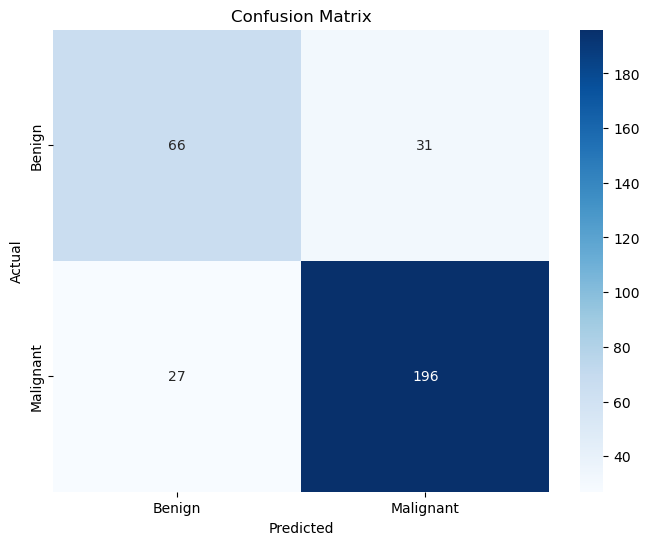
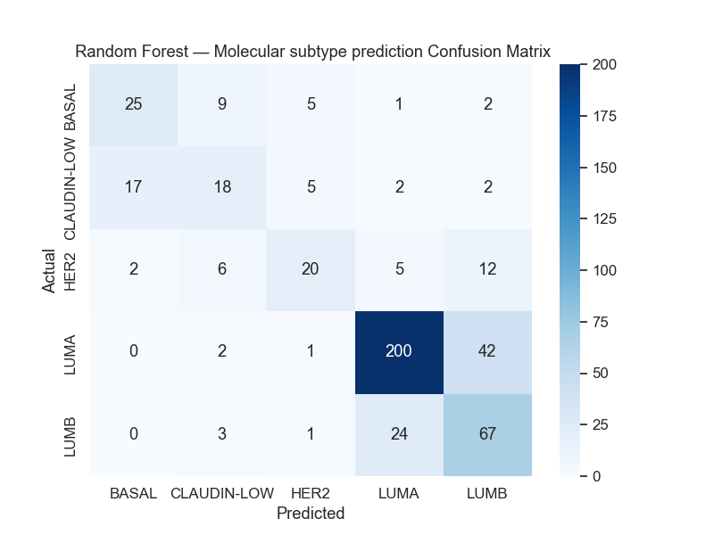
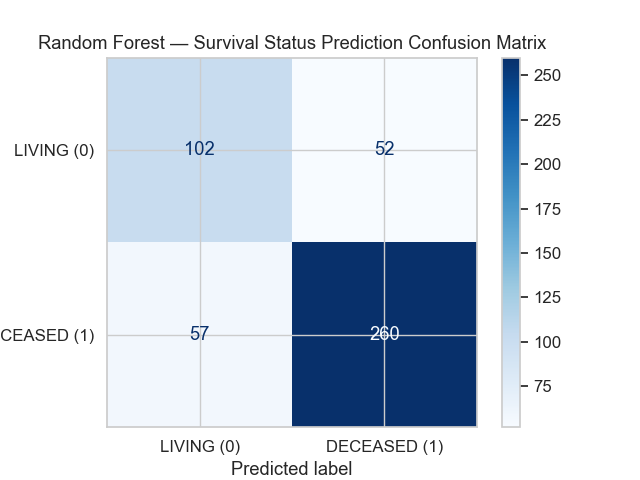

***
## BUSINESS UNDERSTANDING
## OVERVIEW
Breast cancer is a major global health concern, effective care depends on early detection and understanding how a patient’s tumor is likely to progress. 
Manual examination of histopathology images is slow, subjective, and prone to human error. The disease also consist of several molecular subtypes such as Luminal A, Luminal B, HER2-enriched, and Basal-like. Each subtype behaves differently in terms of how fast the tumor grows and how it responds to treatment. Knowing a patient’s subtype helps choose the most effective treatment and predict the patient’s likely outcome. These subtypes are usually identified using the PAM50 assay, an advanced test that is not always easily accessible.

This project addresses these challenges by using CNNs to automatically detect breast tissue images as benign(non cancerous) or malignant(cancerous) to support faster and more consistent detection. It also applies machine learning to predict a patient’s molecular subtype and survival status, providing a practical, data-driven tool that enhances diagnosis, treatment planning, and prognosis.

## PROBLEM STATEMENT
Breast cancer diagnosis and treatment face two main challenges. Manual examination of tissue images is slow, error-prone, and requires specialist expertise, while molecular subtypes that guide treatment are usually identified through a costly genetic tests. This project addresses both by using machine learning to classify breast tissue images as benign or malignant and  to predict molecular subtype and survival outcomes, providing a practical, data-driven tool to support early detection, treatment decisions, and improved patient outcomes.

## BUSINESS OBJECTIVES
This project aims to deliver practical, AI-driven tools that support breast cancer diagnosis and prognosis:

* Image Classification – Develop a deep learning model that accurately distinguish benign and malignant breast tissue images using the BreakHis dataset, enabling faster and more reliable diagnosis.
* Molecular Subtype Prediction – Build a model to predict PAM50 + Claudin-low molecular subtypes (Luminal A, Luminal B, HER2-enriched, Basal-like), providing a digital alternative to costly genetic tests and guiding personalized treatment.
* Survival Prediction – Create models to predict patient survival:
Binary- Living or Deceased
Multi-class: Living, Died of Disease, or Died of Other Causes
* Deploy all models into user-friendly web applications, making them accessible and practical for real-world clinical use. [link](https://breast-cancer-predictor-ziud.onrender.com/) 

## DATA UNDERSTANDING
This project uses two complementary datasets to support breast cancer diagnosis and prognosis:

1. BreakHis Histopathology Image Dataset

The BreakHis dataset is a publicly available collection of microscopic breast tissue images. It contains images of both benign and malignant tumors captured at multiple magnification levels (40×, 100×, 200×, and 400×). Each image is labeled according to its tumor class. 

2. METABRIC Clinical and Genomic Dataset
The dataset comes from the METABRIC (Molecular Taxonomy of Breast Cancer International Consortium) study a well-known clinical and genomic breast cancer dataset containing information on 2,509 patients. Each record represents a patient, with 39 features (12 numerical and 27 categorical). The data is stored in a TSV (tab-separated values) format.

Key Features:
* Pam50 + Claudin-low subtype: Molecular subtype classification (Luminal A, Luminal B, HER2-enriched, Basal-like, Normal-like).
* Age at Diagnosis, Tumor Size, and Tumor Stage: Describe patient demographics and tumor characteristics.
* ER, PR, HER2 Status: Biomarkers critical for determining subtype and treatment response.
* Therapy Indicators: Whether the patient received chemotherapy, hormone therapy, or radiotherapy.
* Lymph Nodes Examined Positive: Shows whether the cancer has spread to the lymph nodes.
* Neoplasm Histologic Grade & Cellularity: Checks tumor aggressiveness.
* Overall Survival & Relapse-Free Status: Capture survival duration and recurrence of the disease.
* Nottingham Prognostic Index (NPI): Combines tumor size, grade, and lymph node status for prognosis prediction.

Data Quality:
Some columns contain missing values (e.g., Tumor Stage – 721, Type of Surgery – 554, Cellularity – 592).
Missing values in numerical columns are imputed with the median, while categorical columns with missing values filled with the mode.

Target Variables:
* Pam50 + Claudin-low subtype → Multi-class target for molecular subtype prediction.
* Overall Survival Status → Binary target for survival prediction (Living / Deceased).
* Patient’s Vital Status → Multi-class target for classifying survival outcomes (Living / Died of Disease / Died of Other Causes).

* Together, these datasets allow the project to build model for image based tumor classification and clinical prognosis prediction, supporting both early detection and personalized treatment planning.

## METHODS
For Image Classification steps followed are:
* Load the Dataset to the correct path of the images
* Count images in each class.
* Check for any duplicates and corrupted images
* Split the dataset, 70% for training, 30% for validation/test
* Handle Class imbalance
* Normalize the training images by scaling and augmentation.
* Prepare validation/test images with rescaling only.
* Build the classifier models
  
For METABRIC Clinical and Genomic Dataset- Predictive and descriptive statistics were used to analyze data and reveal key clinical insights.
steps done include:
* Data Preparation- (Handling missing values and removing duplicates)
* EDA - Explore the distributions, patterns and relationships in the data
* Correlation Analysis- Constructed a correlation matrix to check for multi-collinearity
* Modeling- Build predictive models using different algorithms
* Evaluation and Models Performance Comparisons
* Feature Importance - Identified most influential features contributing to predictions
## EDA
#### Molecular Subtype vs Survival Status


* Comparing survival across molecular subtypes, Luminal A shows the best survival outcomes (highest number of living patients), indicating that this subtype responds well to treatment.

#### Comparing How Different Molecular Subtype Respond to Chemotherapy


* Luminal A show the highest resistance to chemotherapy, suggesting slow response to this type of treatment.
* Basal and HER2 subtypes show good responsiveness to chemotherapy.

#### Comparing How Different Molecular Subtype Respond to Hormone therapy


* Luminal A and Luminal B show the best response to hormone therapy. These Pam50 subtypes usually depend on estrogen or progesterone hormone to grow, and they can often be treated by blocking these hormones

#### ER and PR Status VS Survival rate


* ER+,PR+ have higher survival rates compared to ER-,PR-. ER+ and PR+ have the highest number of living patients and the gap between living patients bar and
lower score for patients who died of disease. ER-,PR- show poor prognosis

#### How Tumor Stage Influnce Survival Status


Lower stages (0 and 1) have better survival rates compared to higher stages(2 and 3)

#### How Age at Diagnosis Influence Survival


Most deceased patients are older. The plot also shows a few outliers within the deceased group, suggesting that while older patients generally have lower survival rates, some younger women also experience poor outcomes(Below 39). Middle-aged women (45–70 years) show the best survival rates overall.

Most Deceased patients are of older age. From the plot there are some outliers for the DECEASED class suggesting that there is lower survival rates for some younger women and older women. Middle-aged women (45-70) show the best survival rates.

## MODELING
### Tumor Image Classification 
Convolutional Neaural Network model and Tranfer learning with MobileNetV2 models were build for this task.
* Models Performance on Malignant Class(Cancerous tumors)
1. CNN: Precision: 0.88, Recall: 0.86, F1_Score: 0.87
2. MobileNetV2: Precision: 0.95, Recall: 0.69, F1_Score: 0.80
* For medical use(Malignant Detection Priority) CNN model performed better, It captures more malignant cases (higher recall) compared to MobileNetV2, reducing the number of false negatives which
* 
* Algorithms used
1. Handling Class Imbalance using class weights to tell model to pay more attention to the minority class
2. Normalization/Rescalling - Scale images value to help the model train faster and avoid gradient
3. 3 Convolutional Layers - To detect patterns like edges, textures and tumor features in the images
4. Pooling layers(Maxpooling) - Reduce feature map size and keep the most important information.
5. l2 Regularization penalty to add a penalty to large weights to make the model more stable and prevent overfitting
6. Dropout penalty to prevent overfitting.
7. Adam Optimizer to Adjust learning rates automatically for faster and stable training.
8. Binary Crossentropy Loss Function to Measure how well the model predicts the correct class.
9. Evaluation Metrics – Use Accuracy, Precision, and Recall to check model performance.


### Molecular subtype prediction
Classify tumors into molecular subtypes using clinical data
2 models were build for this task, Random Forest and XGBoost
* Models performance comparisons.
* Both the models performed best in predictin Luminal A subtype and same accuracy scores of 71%. The Random Forest model had a more balanced prediction across all the classes with a weighted f1-score of 70%. We compare using F1-score because the classes are imbalanced and we desire to treat each class equally for prediction
* 
* Steps applied
1. Lable encode the target column - changes the variables to numerical formart
2. Train Test split - 80% for training and 20% for testing
3. One-hot encode categorical features and standard scale numerical features
4. Smotenc to handle class imbalance
5. Hyperparameter grid to set parameters for the GridsearchCV
6. Prediction then Evaluation.

### Survival Status Prediction
Build models that Predict whether a patient is alive or deceased which allow us to identify high-risk patients who may need closer monitoring.
* Models performance comparisons
The Random Forest model performed best for this prediction compared to Logistic Regression model. It achieved an Accuracy of 77% and 
ROC-AUC of 83% while Logistic Regression model achieved an Accuracy of 73% and ROC-AUC of 79%,
* Higher ROC-AUC  score for Random Forest mean the model is better at distinguishing between positive and negative classes.
Both models performed better at detecting deceased patients than living patients, which is clinically important in identifying high-risk individuals.
* 

## KEY INSIGHTS
1. Convolutional Neural Networks (CNNs) can learn complex patterns in tissue images and achieve high accuracy in distinguishing benign and malignant tumors, supporting faster and more consistent diagnosis.
2. Data augmentation increases the diversity of training images (e.g., rotations, flips, zooms), which helps the model generalize better, reduces overfitting, and typically improves validation and test accuracy.
3. Using features like tumor stage, biomarkers (ER, PR, HER2), patient age, and histologic grade, machine learning models can predict molecular subtypes with reasonable accuracy, offering a cost-effective alternative to genetic tests.
4. Tumor stage, Age at DiagnosiS, Lymph nodes examined positive, Integrative Cluster, (ER, PR, HER2) biomarkers  and treatment indicators (chemotherapy, hormone therapy, radiotherapy). These features strongly influence survival predictions.

## CONCLUSIONS
1. Predictive models can help identify high-risk patients and improve clinical decision-making.
2. Treatment can be adjusted based on the type of  breast cancer  for  the best outcomes.
3. Prioritize extra care for patients with the highest risk


## RECOMMENDATIONS
1. For health centres:  Embed these predictive tools in clinical workflows to assist in making faster and more informed decisions 
2. For Personalised care: Tailor treatment based on individual characteristic enabling more precise and effective care.
3. Focus follow-up and resources on highest-risk patients eg Older patients, patients with Large & High grade tumors, patients with more positive lymph nodes
4.  Prioritize public awareness, screening programs & routine check-ups to  promote early stage detection.
 
****


```
